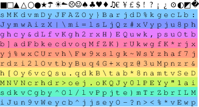
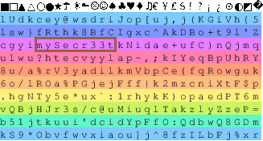
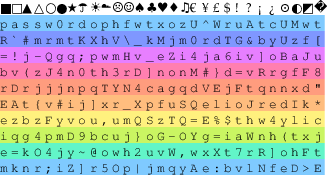

Simple Passwordcard generator

Heavily inspired by http://www.passwordcard.org
however it lacked the feature to include existing user-generated passwords. So I created my own...

Example output:

You can also use your own (existing) passwords.
This will create a passwordcard and put the password 'mySecr33t in row 3, column 5 (0-based indexing):

    generate_passwordcard.py mySecr33t 2 4

Similarly, you can provide multiple (up to 10) passwords, like the following:

    generate_passwordcard.py passw0rd 0 0 4n0th3r 3 5

Please make sure to use passwords that have high entropy, otherwise anybody can spot them in the random background...
